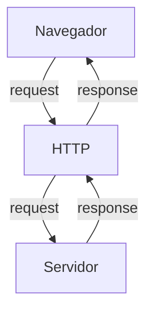
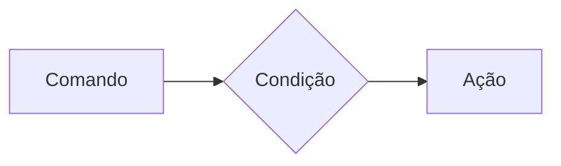
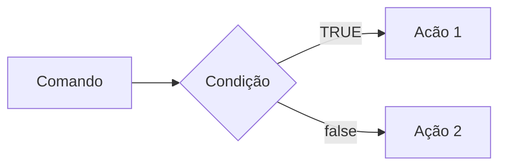
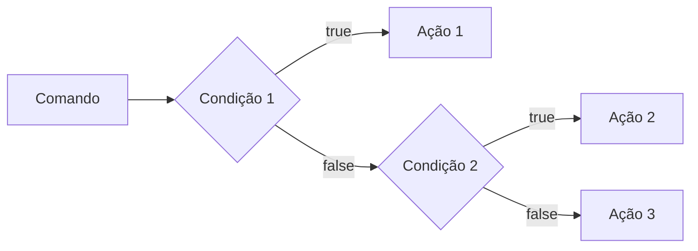
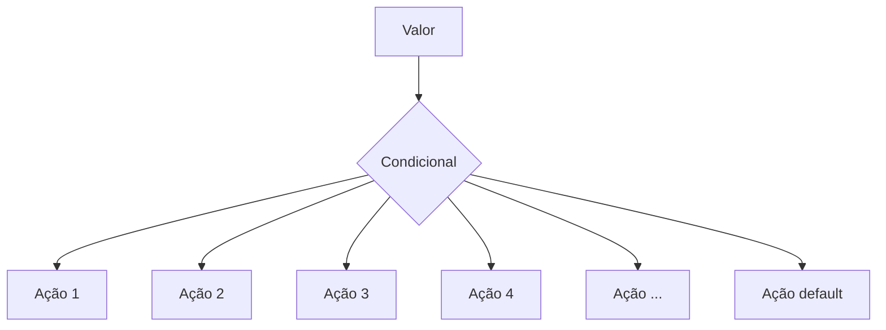
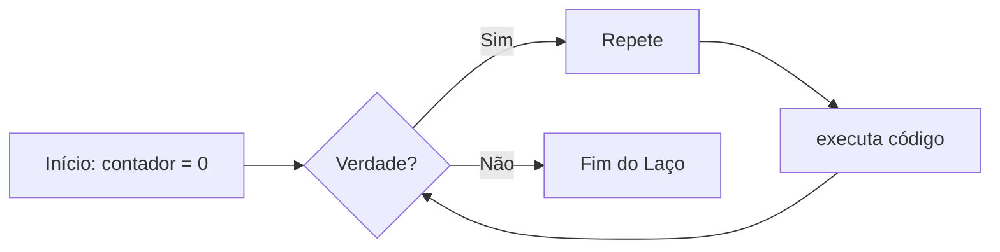
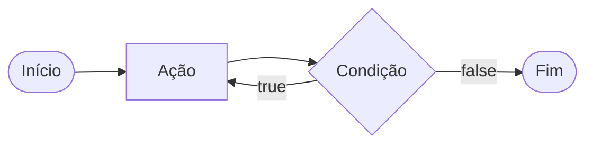
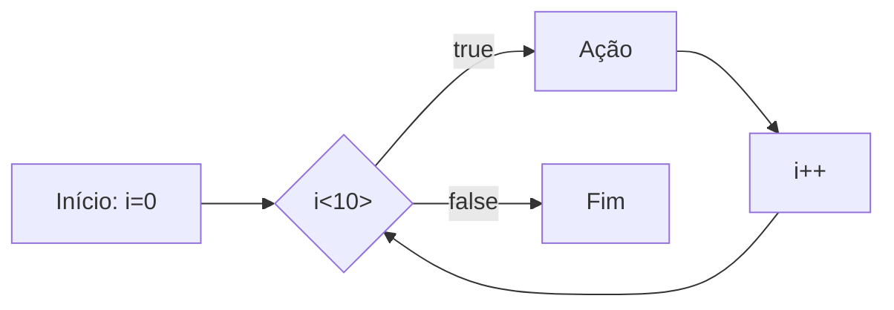

# Curso BackEnd - 225h - Técnico em Desenvolvimento de Sistemas - SENAI

Profº Diogo TB

Escola SENAI Americana

2º Semestre 2026

## Objetivos do Curso

- Desenvolver Apricações web Server Side, utilizando a línguagem PHP;
- Aplicar sisntaxe Nativa PHP (Vanilla);
- Manipulção HTTP;
- Persistência de Dados;
- Segurança contra SQL Injection/CSRF;
- Refatoração em POO (Programação Orietada ao Objeto);
- Arquitetura MVC (Model, View, Controller);
- Utilização do FrameWork Laravel;

obs: framework - um conjunto de bibliotecas que oferecem uma solução completa para o desenvolvimento de alguma coisa

## Cronograma do Semestre

Carga Hóraria: 105h 1º Semestre e 120h 2º Semestre

Duração: 20 Semanas 1º Semestre e 20 Semanas 2º Semestre

---

### Semana 1: Introdução ao BackEnd e Configuração do AMbiente PHP

#### O que é BackEnd: 

O back-end é a parte de uma aplicação que o usuário não vê, mas que faz tudo funcionar por trás das telas.

O Back-End é a parte de um sistema que funciona nos servidores, sendo respondável por executar a lógica da aplicação, processar informaões e armazenar dados.

Além disso, o BackEnd é responsável por atender ás solicitações do Frontend

Sobre o mercado atual: o cenário é bom, mas mais exigente do que era. Quem conhece só o básico enfrenta mais concorrência. Quem alia backend sólido com IA aplicada, cloud e inglês está num patamar completamente diferente — vagas internacionais remotas são uma realidade pra esse perfil.

O Backend é formado pelo servidor, banco de dados, lógica de programação com APIs e linguagens de programação/frameworks. Esses componentes trabalham juntos para processar dados, armazenar informações e garantir o funcionamento da aplicação.

# Para que serve
-Processar lógica de negócio: regras, cálculos, validações (ex: calcular frete, aplicar desconto, validar login)

-Gerenciar banco de dados: salvar, buscar, atualizar e deletar informações

-Autenticação e autorização: controlar quem pode acessar o quê (login, senhas, permissões)

-Fornecer APIs: criar "pontes" (endpoints) para o frontend ou outros sistemas consumirem dados

-Integração com serviços externos: pagamentos, e-mails, notificações, APIs de terceiros

-Segurança: proteger dados sensíveis, evitar ataques (SQL injection, XSS, etc.)

-Escalabilidade e performance: garantir que o sistema aguente muitos usuários ao mesmo tempo.

# Principais Tecnologias Linguagens de programação: 
 Ferramentas usadas para escrever o código do servidor, como Python, Node.js (JavaScript), Java e PHP.APIs: Os "caminhos" que permitem que o que você vê no celular converse com o servidor.


**Areas de Atuação**
  Fintechs e Bancos
Segurança, transações, alta escala 

E-commerce
Catálogo, pedidos, pagamentos

Healthtechs
Prontuários, telemedicina

SaaS / Startups
Backend é o coração do produto

Logística
Rastreio, rotas, tempo real

Educação
Plataformas, conteúdo, usuários

#### O ciclo de Vida da Requisição HTTP

##### O que é HTTP?

*http*, Hypertext Transfer Protocol, é um protocolo de comunicação utilizado para transferência de infomações na www (World wide Web) e em outros sistemas de redes.

O HTTP é a base para que o cliente e um servidor web toquem informações. Ele permite a requisição e a resposta derecursos como, imagens, arquivos e textos.



#### Como funciona na Prática o BackEnd

- **Ação do Usuário**: Envia uma dolicitação pela UI(Interface do Usuário). Exemplo de UI: Tela do celular, Navegador da Internet, Alexa, IOT ...
- **Envia una Requisição**: A UI transforma ação do Usuário em uma Requisição HTTP.
- **O Processamento BackEnd**: O código BackEnd recebe o pedido, valida os dados e decide o que fazer. Ex: consultar uma informação no BD(Base de Dados).
- **Resposta**: O servidor devolve o resultado para a UI. Ex: Um Login Autorizado, Confirmação de uma Compra...

#### Tipos de Requisição HTTP

Os tipos de requisição HTTP indicam a ação que o usuário deseja executar no servidor. As principais ações são:

- **GET**: Pede dados de um lugar específicodo servidor. "Não faz Alterações no Servidor"
- **DELETE**: Apaga um Dados de Servidor.
-**POST**: Envia dados novo para *criar*alo ou processar informações no servidor.
- **PUT/PATCH**: Modificar um dados já existente.

---

#### Iniciando o PHP

**PHP** (HyperText PreProcessor) é uma liguagem de programação interpretada e open souce, focada no desenvolvimento de sistemas para web, pode ser usada junto com HTML para criação de páginas web dinâmicas.

O PHP de fato é uma das línguaens e programação mais populars da atualidade. Ela permite que você crie aplicações web robustas, de uma maneira simplificada e direta. A linguagem tem diversosos recursos que facilitam e aceleram o processo de desenvolvimento de sites e sistemas para web. E além do mais, ela ainda tem um ótimo ecossistema, uma excelente comunidade e um grande mercado de trabalho.

#### Instalandi o PHP 

- Fazer o Download do PHP (php.net)
- ZIP - NTS(Non Thread Safe) 8.5
- Descompactar o Arquivo do PHP na pasta C:\src\php (Para Descompactar usar o 7Zip = Melhor) => nunca salvar arquivo ou programas na raiz do sistema(C:)
- Adicionar a Pasta do PHP(C:\src\php) as Variáveis de Ambiente do Sistema (PATH)
- Verificar a Instalação rodando o comando *php --version*

##### Criando Minha Primeira Aplicação em PHP

1. Antes de comçar a Codar:

- Preparar o meu VCCODE:
    - Criar um Profile próprio para PHP
    - Instalar Extensões Necessaária para transformar o VSCODE em um IDE
    IDE:
      - PHP Interlephense => Permite a utilização de Snippets (É um atalho de Códigos)
      - PHP Debug => Ajuda a gente a encontrar erros de códigos
      - PHP Cs Fixer => Formatação de código (Identeção) (Deixa o código bonito)
      - PHP Server => Ajuda na criação de um servidor local para PHP 
    - Desabilitamos o PHP Nativo do VSCode (@builtin PHP)

2. Hello Worls (muito importante)

#### Estudo de Variávveis e Constantes em PHP

Declarar variáveis é alocar um espaço na memória que permite a inclusão e manipulação de dados.

**Variáveis**

- Devem ser declaradas usando "$" antes do nome da variável
- São não tipadas (Não precisa declarar o tipo dela na cração),
- Podem ser String, Numérica ( interger e float), Booleans e Nulas. Não Permite declaração de Undfined
- Usar o "declare (Strict_types=1);" na primeira linha do arquivo ; => Blinda o sistema contra conflitos de tipos de variáveis 

**Constantes**

- Não podem ser mudadas ou redeclaaradas apóes a criação
- Pode, ser criada usando "const" ou "define"
- Não permite interpolação (Um texto unico)

#### Estudo de Operadores

**Aritméticos**: São usados para realizar Cálculos 

| Operador | Nome | Exemplo | Resultado |
| - | - | - | - |
| + | Adição | 10 + 5 | 15 |
| - | Subtração | 10 - 5 | 5 |
| * | Multiplicação | 10*5 | 50 |
| / | Divisão | 10/5 | 2 |
| % | Modulo(Resto) | 10% | 1 (10div 3 da 3, sobra 1) |
| ** | Expoente | 2**3 | 8(2 elevado a 3) |

Obs: O operador % é o melhor amigo de um programador, permite ordenar çistas e organizar fila e pilhas

**Relacionais**: Permite o Relacionamento entre dois ou mais valores, o resultado de uma operação é sempre uma Boolena (verdadeiro ou falso).

| Operador | Significado | Exemplo | Resultado |
| - |  - | - | - |
| > | Maior que | 18 > 18 | falso |
| >= | Maior ou igual a | 18 >= 18 | true |
| < | Menor que | 10 < 20 | true |
| <= | Menor ou igual a | 10 <=5 | false |
| == | Comparação de Valor | "10"==10 | true | 
| === | Comparação Estrita | "10"===10 | false |
| != | Diferente | "10!=10 | false |
| !== | Estritamente Diferente | "10"!==10 | true |


**Lógicos**: Permite a Combinação entre semtenças.

- Oprador AND (E) => && : Para o resultado ser verdadeiro, Todas as Comnibações precisam ser verdadeiros
    - true && true => true
    - true && false => false

- Operador OR (OU) => || : Para o resultado ser verdadeiro, Basta apenas uma condição ser verdadeira
    - false || true => true 
    - false || false => false 

- Operador NOT (Não) => ! : Inverte a lógica da Operação, 
    - !true => false
    - !false => true

### Semana 3 - Estrutura de Controle de Dados (Condicionais e Repetição)

- **Conteúdo**: Estrutura `if`, `else`, `elseif`, operadores ternários, `match` => substituto do `switch/case`, loops `for`, `while`, `do-whilw` e `foreach`

#### Estrutura de Controle de Dados Ajudam no Processo de Automatiação em Programação e Sistema

#### Condicionais (IF, ELSE, ELSEIF)

**Formas de Uso**

- uso do `if` apenas:
Exemplo: Aplicar descontos de 10% em compras acima de 100 Reais;



```php

if($valorCompra > 100){
    $valorFinal = $valorCompra * 0.9;

}
```

-Uso do `if` e do `else` 
Exemplo: Aplicar um desconto de 10% para compras acima de 100  Reais e 5% para as demais compras



```php

if($valorCompra > 100){
    $valorFinal - $valorCompra * 0.9;
} else {
    $valorFinal = $valorCompra * 0.95;
}
```
- Uso `elseif` (If Encadeado) => Estrutura usada para manipulação de dados de duas ou mais condicionais.
Exemplo: Compras acima de 200 reais tem 15% de desconto, compras acima de 10 reais tem 10% de desconto e demais compras de 5% desconto



```php

if($valorCompra > 200){
    $valorFinal = $valorCompra * 0.85;
} elseif($valorCompra > 100) {
    $valorFinal = $valorCompra * 0.9;
} else {
    $valorFinal = $valorCompra * 0.95;
}

```

*Obs*: Sempre usar `elseif` para situações que precisam de mais de uma condição, ou seja, fazer encadeamento das condições

- Uso *ERRADDO* do if 

```php 

if($valorCompra > 200) {
    $valorFinal = $valorCompra * 0.85;
}
if($valorCompra > 100) {
    $valorFinal = $valorCompra * 0.9;
} else {
    $valorFinal = $valorCompra * 0.95
}

```

#### Operador Ternários

Um atalho para a estrutura condicional `if/else`, normalmente escrita em uma ´´única linha de código.

` condição ? verdadeira : falsa ` 

Perfeito para decisões curtas de uma linha de comando

Exemplo: Verificar se a pessoa é maaior de idade (18);

```php

$idade = 20;
//O formato é (Condição) ? Verdadeiro : Falso;

$status = ($idade>=18) ? "Maior de idade" : "Menor de idade";
$status2 = ($idade>=60) ? "Idoso" : ($idade>=18) ? "Adulto" : "Criança" ;

echo $status //

```

#### Expressão Condicional `match` (PHP 8)

No mercado atual de PHP, não se uma mais uma `Switch/Case` para chegar valores fixos, usa-se o `match`. Ele compara um valor e retoran diretamente o resultado caso atenda a condição.



Exemplo: Selecionar o Dia da Semana a partir dee um Nº 

```php

$diaSemana = date("W"); // Pega o Dia da semana em formto numérico

$nomeDiaSemana = match($diaSemanaNu) {
    "0" => "Domingo",
    "1" => "Segunda",
    "2" => "Terça",
    "3" => "Quarta",
    "4" => "Quinta",
    "5" => "Sexta",
    "6" => "Sábado",
    "default" => "Dia Inválido"
};

echo " Hoje é : $nomeDiaSemana";

```

---

#### Laços de Repetição

Um laço de repetição faz com que um bloco de código rode várias vezes até que uma condição mande parar.

- O Laço While (Enquanto)

Ele verifica se a condição é verdadeira ANTES de entrar no laço. Ideal quando você não sabe exatamente quantas vezes vai rodar o laço. 



Exemplo de Aplicação do While: Jogo de A divinhação de um nº Secreto

```php

$numeroSecreto =  rand(1,10);

$tentativas = 0;

$numeroEscolhido = 0;

while(numeroEscolhido != numeroSecreto){
    echo "Tente Novamente"
    //Vou escolher outro Nº para adivinhar
    numeroEscolhido = rand(1,10);
    tentativas++;
}

echo "Acertou Miseravel!!! o nº secreto é $numeroEscolhido";

```

- O Laço `do-while` (Faça - Enquanto)

A diferença é que ele executa o bloco pelo menor uma vez, mesmo que a condição seja false desde o início, pois ele só pergunta no final.



Exemplo: Jogo de Adivinhação  de um nº

```php

$numeroSecreto = rand(1,10);

do{
    $numeroEscolhido = rand(1,10);

    if(numeroEscolhido == numeroSecreto){
        echo "Parabéns, Acertou!!!";
        break;
    }
    echo "Tente Novamente!!!"

} while(numeroEscolhido != numeroSecreto);

```

#### O Freio de Emergência: `break` e `continue`

As vezes precisamos interferir no laço enquanto ele está rodadndo

- `break`=> **Para Tudo** Quebra o laço inteiro e vai embora
- `continue` => **Pula a rodada!** Ele ignora o código daquela rodada especifica e pula logo para próxima repetição.

Exemplo de Aplicação de Código: Sistema de Controle de elevador

```php

for($andar = 1 ; $andar<=10; $andar++){
    if($andar ==4){
        echo "Andar $andar está em obra. Passando direto!";
        continue;
    }
    echo "Elevador parou no andar $andar"
}

```
---

##### Laço de Repetição `for`

Use o `for` quando você sabe quanras vezes precisa repetir uma ação ou quando precisa controle um contador. Ele possui três partes:

- inicialização,
- condição,
- incremento;

for(inicialização; condição; incremento){}


Exemplo: Exibir todos os meses do Ano

```php
for($mes=1; $mes++){
    echo "Mês $mes";
}
```
Nesse Exemplo, `$mes` começa com 1, o laço continua enquanto `$mes`for menor ou igual a 12 e, ao final de cada repetição, `$mes++`aumenta o contador em 1.

##### Laço de Repetição `foreach`

Use o `foreach` quando precisar percorrer cada item de um *array*.Ele acessa os elementos diretamente, sem qe você precise controlar o contador.

Exemplo: Imprimir todos os itens de um vetor 

```php

$frutas = ["Maça", "Banana", "Uva", "Pera",];

foreach($fruta as $frutas){
    echo "Fruta: $fruta";
}
```

Outro Exemplo: Acessar a chave e o valor de cada item:

```php

$precos = [
    "Caderno" => 25.90,
    "Caneta" => 5.50
    "Mochila" => 99.00
]; // Vetor não ordenado chave =>  valor

foreach ($preco ass $produt0 => $preco){
    echo "$produto: R$ number_format($preco,2)";
}
```

---
--- 
#### Desafio : Simuladro de Cobrança (FINANSENAI) 

#### Desafio Final

---
---

### Semana 4 - Modularização com Funções

#### Principio de DRY ( `Don't Repeat) Yourself`) 

Se uma lógica foi escrita duas vezes ou mais dentro de um código, essa lógica deve virar uma função.

#### Funções Nativas do PHP

O PHP tem milhares de funções prontas, essas funções são chamadas de nativas.

- **O que é uma função?**

Uma função é como uma máquina: você coloca um matéria-prima (Parâmetro), ela processa e devolve um produto final (Retorno)

Exemplo de Função Nativa:

```php

$texto = "senai americana";

//str_replace(ele busca um pedaço do texto e substitui por outro)
$textoNovo = str_replace("americana","são paulo",$texto)

//strtoupper
echo strtoupper($textoNovo); //SENAI SÃO PAULO

```

##### Principais Funções Nativas ( Mais Utilizadas )


As funções abaixo já fazem parte do PHP e podem ser chamadas diretamente no código. Observe os parâmetros que cada uma recebe e o tipo de informação que ela retorna.

| Função | Categoria | O que faz | Como usar |
|---|---|---|---|
| `strlen()` | Strings | Retorna a quantidade de caracteres de um texto. | `$tamanho = strlen($texto);` |
| `strtoupper()` | Strings | Converte o texto para letras maiúsculas. | `$resultado = strtoupper($texto);` |
| `strtolower()` | Strings | Converte o texto para letras minúsculas. | `$resultado = strtolower($texto);` |
| `ucfirst()` | Strings | Converte a primeira letra do texto para maiúscula. | `$resultado = ucfirst($texto);` |
| `trim()` | Strings | Remove espaços e quebras de linha no início e no fim do texto. | `$limpo = trim($texto);` |
| `str_replace()` | Strings | Substitui uma parte do texto por outra. | `$novo = str_replace("-", "", $cpf);` |
| `substr()` | Strings | Extrai uma parte do texto a partir de uma posição. | `$inicio = substr($texto, 0, 3);` |
| `explode()` | Strings | Divide um texto e cria um array usando um separador. | `$palavras = explode(" ", $nome);` |
| `implode()` | Arrays | Junta os itens de um array em um único texto. | `$lista = implode(", ", $nomes);` |
| `count()` | Arrays | Conta a quantidade de itens de um array. | `$total = count($produtos);` |
| `in_array()` | Arrays | Verifica se um valor existe dentro de um array. | `$existe = in_array("SP", $estados, true);` |
| `array_push()` | Arrays | Adiciona um ou mais itens ao final de um array. | `array_push($nomes, "Ana");` |
| `array_pop()` | Arrays | Remove e retorna o último item de um array. | `$ultimo = array_pop($nomes);` |
| `sort()` | Arrays | Ordena um array em ordem crescente e reorganiza suas chaves. | `sort($notas);` |
| `array_keys()` | Arrays | Retorna um array contendo as chaves de outro array. | `$chaves = array_keys($produtos);` |
| `number_format()` | Números | Formata um número com casas decimais e separadores definidos. | `$preco = number_format($valor, 2, ',', '.');` |
| `round()` | Números | Arredonda um número para a quantidade de casas informada. | `$media = round($nota, 2);` |
| `max()` | Números | Retorna o maior valor de uma lista ou array. | `$maior = max($notas);` |
| `min()` | Números | Retorna o menor valor de uma lista ou array. | `$menor = min($notas);` |
| `is_numeric()` | Validação | Verifica se o valor é um número ou uma string numérica. | `if (is_numeric($entrada)) { ... }` |
| `isset()` | Validação | Verifica se uma variável existe e não possui valor `null`. | `if (isset($usuario)) { ... }` |
| `empty()` | Validação | Verifica se uma variável está vazia. | `if (empty($pedido)) { ... }` |
| `date()` | Data e hora | Formata uma data ou hora conforme uma máscara. | `$hoje = date('d/m/Y');` |
| `file_exists()` | Arquivos | Verifica se um arquivo ou diretório existe. | `if (file_exists('dados.txt')) { ... }` |
| `file_get_contents()` | Arquivos | Lê todo o conteúdo de um arquivo ou endereço. | `$conteudo = file_get_contents('dados.txt');` |
| `file_put_contents()` | Arquivos | Grava conteúdo em um arquivo, criando-o se necessário. | `file_put_contents('log.txt', $mensagem);` |

**Atenção:** algumas funções modificam o array original, como `sort()`, `array_push()` e `array_pop()`. Já outras retornam um novo valor, como `count()`, `explode()` e `str_replace()`. Em caso de dúvida, consulte a documentação oficial do PHP e verifique o retorno da função.


##### Documentação PHP

[Acesse a documenteção oficial do PHP em português](https://www.php.net/manual/pt_BR/)

Consulte também a [Referência de funções do PHP](https://www.php.net/manual/pt_BR/funcref.php) Para pesquisar a sintaxe, os parâmetros e os valores de cada função.


#### Funções Customizadas (Criando suas próprias máquinas) 

Quando o PHP não tem a função que queremos, nós a criamos!

**A Regra de Ouro:** Uma Dunção deve focar em `return` (retornar um valor), e não imprimir (`echo`).

Veja a diferença nesse exemplo:
```php

function calcularTotal($preco, $quantidade){
    //A função calcula e retorna o resultado, mas não imprime nada
    return $prco * $quantidade;
}

$total = calcularTotal(25.00, 3);

echo "Total da compra: R$ " . number_format($total, 2, ",", ".");
//Total da compra: R$ 75,00

```

A função `calcularTotal()` pode ser reutilizada em uma página, relatório ou teste. O `echo` aparece somente fora da função, no momento de apresentar o resultado ao usuário

##### Padrão de Uso Corporativo (PHP 9 Strict Types)

No mercado de trabalho, exigimos que a função avise exatamente o **TIPO** de dado que ela espera receber e o **TIPO** que ela vai devolver.

Isso é chamado de **Tipagem de funções**. Ao declarar os tipos, o códigos fica mais fácil de entender e o PHP consegue identificar alguns erros antes que eles causem problemas maiore no sistema.
Os tipos mais usados:

* `int`: número inteiro, `10` ou `1024`
* `float`: número decimal ou ponto flutuante, `10.50`.
* `string`: texto, como `"Maria"`.
* `bool`: valor lógico, `true` ou `false`.
* `void`: identifica que a função não devolve nenhum valor.

O tipo deve ser escrito antes do nome de cada parâmetro e o tipo da função deve ser escrito após os parênteses, precedito por `:`, informando o que a função vai devolver.

Exemplo de uso:

```php
function apresentarProduto(string $nome, float $preco): string{
    return "$nome cuta R$ $preco";
}

 $mensagem = apresentaProduto("Caderno", 25.90);
 echo $mensagem;
 //Caderno custa R$25.90

```

> **Resumo**: Os tipos dos parâmetros documentam as entradas da função, o tipo após `:` documenta a saída da função

##### O tipo Mágico : `void`

Se uma função faz um trabalho interno e **não retorna NADA**, dizemos que o retorno dela é "vazio" (`void`)

Exemplo de função sem retorno:

```php
function registroLog(string $mensagem): void{
    //Apenas salvar em um arquivo de texto, não devolver nenhuma variável
    file_put_contents("erro;log",$mensagm);
}
```

#### Escopo e Referência (O segredo da memória)

##### O que é Escopo? (A regra de Las Vegas)

*O que acontece dentro da função, fica dentro da função*. Uma variável criada fora não existe lá dentro, e uma criada lá dentro morre quando a função acaba.

**Escopo** pe o local do programa onde a variável pode ser armazenada/acessada. Em PHP, uma variável criada fora de uma função pertence ao **Escopo Global**. Uma variável criada dentro de uma função pertence ao ***Escopo Local**.

Exemplo de Escopo de variável:

```php

$nomeSistema = "CRM Senai"; //Variável global 

function criarMensagem():string{
    $mensagem = "Bem-Vindo!"; //Variável local
    return $mensagem;
}

echo $nomeSistema; //Correto: está no escopo global
echo criarMensagem(); //Correto: a função devolve sua variável local.
//echo $mensagem; //Incorreto: $mensagem só existe dentro da função, não é acessada fora.
```

* Como enviar dados para uma função?

A forma mais segurae organizada é enviar os dados por **Parâmetros**.
Assim, a função não ´recisa acessar diretamente variáveis global:

```php
function saudar(string $nome):string{
    return "Olá, $nome!";
}

$nomeCliente = "João";
echo saudar($nomeCliente); //Olá, João!
```

Nesse caso, `$nomeCliente` continua no escopo global, mas seu valor é enviado para parâmetro local `$nome`. A função recebe uma informação, processa e retorna o resultado.

Exemplo Incorreto:

```php
$no,e = "João";
function saudar():string{
    return "Olá, $nome";
}
```

A função `saudar()` não conhece a variável global `$nome`

> **Resumo:** variáveis protegem os dados internos da função; parâmetros são o caminho recomendado para evitar erros e enviar informações, e `return` é usado para devolver um resultado ao código que chamou a função.

---

### Semana 05 - Arrays e Manipulação Avançada de Dados

Um array (também conhecido como vetor) é uma estrutura de dados usados para armazenar vários em uma única variavel.

**Tipos de Arrays em PHP:**

- Indexados/Ordenados(Némerica): Usam Números inteiros como índices (chaves), que começam em zero por padrão;
- Associativos/Não Ordenados(String): Usam chaves(String) para identificar valores;
- Multidimensionais: Contêm um ou mais arrays dentro de outro array.

**Exemplo de Arrays:**

```php
//array indexado
$frutas = ["maça", "banana", "laranja"];

//array associativo
$capitais = [
    "SP" => "São Paulo",
    "RJ" => "Rio de Janeiro",
    "MG" => "Belo Horizonte",
    "ES" => "Vitória",
];

//acessando os dados dos Arraays 

echo $frutas[1]; //banana
echo $capitais["MG"]; //Belo Horizonte
```

> Obs: Em arrays associativos, nos trocamos os nº do índice por Nomes (Chaves/Keys). Na Declaração do Vetor usando setinha(=>) que significa "recebe"

#### Arrays Multidimensionais (Banco de Dados na Memória)


É aqui que o "BackEnd" começa de verdade. O Array Multidimensionais é o formato como os Bancos de Dados e Apis respondem as solicitações feitas pelo BackEnd.

**Exemplo de Array Multidimensional:**

```php
$clientes = [
    ["id" => 1, "nome" => "Ana", "email" => "ana@email.com", "ativo" => true],
    ["id" => 2, "nome" => "Bruno", "email" => "bruno@email.com", "ativo" => false],
    ["id" => 3, "nome" => "Carlos", "email" => "carlos@email.com", "ativo" => true],
];

//Como Acessar o Email do Carlos 
echo $clientes[2]["email"]; //carlos@hotmail.com
```

#### O Melhor amigo dos Array: `O Foreach`

O laço de repetição especial para array. O `foreach` percorre cada elemento de um array

**Exemplo de Aplicação:**

```php
foreach($clientes as $clientesAtual){
    echo $clienteAtual["nome"];
    echo $clienteAtual["email"];
}
//Vai implimir nome e email de todos os Clientes do array
```

#### Tranformações de Array e Arrow Function

Transfomações de arrays são usandas para modificar ou filtrar informações de um array existente 

- `array_filter`
Serve para buscar dados em um array e devolver apenas os dados que passarem pelo filtro

```php
$clientesAtivos = array_filter($clientes, fn($c) => $c["ativo"]===true);
//novo array, tera apenas as clientes que a chave ativo for igual a true 
```

- `array_map`
Serve para alterar Todos os dados de um array de uma única vez

```php
$produtos = [
    ["id"=>1, "preco"=10.00, "setor"=>"jardim"],
    ["id"=>2, "preco"=15.90, "setor"=>"ferramenta"],
    ["id"=>3, "preco"=23.50, "setor"=>"jardim"],
]
//ajudar o preço de todos os prudutos em 10% de aumento 

$produosAjustados = array_map(fn($p) => $p["preco"] = $p["preco"]*1.1, $produtos);
```
> Obs: Para a função de filtragem, primeiro selecionamos a array e depois criamos a função de filtro. Para a função de mapeamento, primeiro criamos a função de transformação e depois aplicamos no array.

#### Debugando um Array (Kit de Primeiros Socorros)

- `print_r`
função usada para exibir informações sobre um array de forma legível em liguagem natural

```php
echo print_r($frutas);
//array
(
    [0] => "maça",
    [1] => "banana",
    [2] => "laranja"
)
```

- `var_dump`
Exibi com mais detalhes as informações de um array ou variável em PHP

```php
echo var_dump($frutas);
// Mostra tudo: tipo de dados, o tamanho e o valor
```