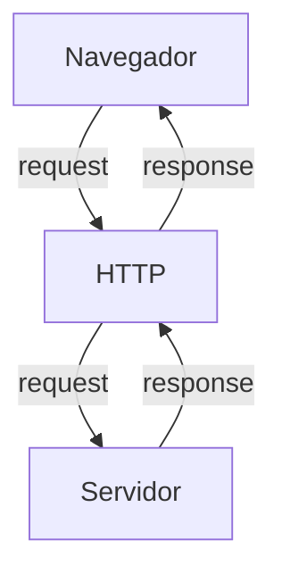

# Curso BackEnd - 225h - Técnico em Desenvolvimento de Sistemas - SENAI

Profº Diogo TB

Escola SENAI Americana

2º Semestre 2026

## Objetivos do Curso

- Desenvolver Apricações web Server Side, utilizando a línguagem PHP;
- Aplicar sisntaxe Nativa PHP (Vanilla);
- Manipulção HTTP;
- Persistência de Dados;
- Segurança contra SQL Injection/CSRF;
- Refatoração em POO (Programação Orietada ao Objeto);
- Arquitetura MVC (Model, View, Controller);
- Utilização do FrameWork Laravel;

obs: framework - um conjunto de bibliotecas que oferecem uma solução completa para o desenvolvimento de alguma coisa

## Cronograma do Semestre

Carga Hóraria: 105h 1º Semestre e 120h 2º Semestre

Duração: 20 Semanas 1º Semestre e 20 Semanas 2º Semestre

---

### Semana 1: Introdução ao BackEnd e Configuração do AMbiente PHP

#### O que é BackEnd: 

O back-end é a parte de uma aplicação que o usuário não vê, mas que faz tudo funcionar por trás das telas.

O Back-End é a parte de um sistema que funciona nos servidores, sendo respondável por executar a lógica da aplicação, processar informaões e armazenar dados.

Além disso, o BackEnd é responsável por atender ás solicitações do Frontend

Sobre o mercado atual: o cenário é bom, mas mais exigente do que era. Quem conhece só o básico enfrenta mais concorrência. Quem alia backend sólido com IA aplicada, cloud e inglês está num patamar completamente diferente — vagas internacionais remotas são uma realidade pra esse perfil.

O Backend é formado pelo servidor, banco de dados, lógica de programação com APIs e linguagens de programação/frameworks. Esses componentes trabalham juntos para processar dados, armazenar informações e garantir o funcionamento da aplicação.

# Para que serve
-Processar lógica de negócio: regras, cálculos, validações (ex: calcular frete, aplicar desconto, validar login)

-Gerenciar banco de dados: salvar, buscar, atualizar e deletar informações

-Autenticação e autorização: controlar quem pode acessar o quê (login, senhas, permissões)

-Fornecer APIs: criar "pontes" (endpoints) para o frontend ou outros sistemas consumirem dados

-Integração com serviços externos: pagamentos, e-mails, notificações, APIs de terceiros

-Segurança: proteger dados sensíveis, evitar ataques (SQL injection, XSS, etc.)

-Escalabilidade e performance: garantir que o sistema aguente muitos usuários ao mesmo tempo.

# Principais Tecnologias Linguagens de programação: 
 Ferramentas usadas para escrever o código do servidor, como Python, Node.js (JavaScript), Java e PHP.APIs: Os "caminhos" que permitem que o que você vê no celular converse com o servidor.

**Areas de Atuação**
  Fintechs e Bancos
Segurança, transações, alta escala 

E-commerce
Catálogo, pedidos, pagamentos

Healthtechs
Prontuários, telemedicina

SaaS / Startups
Backend é o coração do produto

Logística
Rastreio, rotas, tempo real

Educação
Plataformas, conteúdo, usuários

#### O ciclo de Vida da Requisição HTTP

##### O que é HTTP?

*http*, Hypertext Transfer Protocol, é um protocolo de comunicação utilizado para transferência de infomações na www (World wide Web) e em outros sistemas de redes.

O HTTP é a base para que o cliente e um servidor web toquem informações. Ele permite a requisição e a resposta derecursos como, imagens, arquivos e textos.

#### Como funciona na Prática o BackEnd

- **Ação do Usuário**: Envia uma dolicitação pela UI(Interface do Usuário). Exemplo de UI: Tela do celular, Navegador da Internet, Alexa, IOT ...
- **Envia una Requisição**: A UI transforma ação do Usuário em uma Requisição HTTP.
- **O Processamento BackEnd**: O código BackEnd recebe o pedido, valida os dados e decide o que fazer. Ex: consultar uma informação no BD(Base de Dados).
- **Resposta**: O servidor devolve o resultado para a UI. Ex: Um Login Autorizado, Confirmação de uma Compra...

#### Tipos de Requisição HTTP

Os tipos de requisição HTTP indicam a ação que o usuário deseja executar no servidor. As principais ações são:

- **GET**: Pede dados de um lugar específicodo servidor. "Não faz Alterações no Servidor"
- **DELETE**: Apaga um Dados de Servidor.
-**POST**: Envia dados novo para *criar*alo ou processar informações no servidor.
- **PUT/PATCH**: Modificar um dados já existente.

---

#### Iniciando o PHP

**PHP** (HyperText PreProcessor) é uma liguagem de programação interpretada e open souce, focada no desenvolvimento de sistemas para web, pode ser usada junto com HTML para criação de páginas web dinâmicas.

O PHP de fato é uma das línguaens e programação mais populars da atualidade. Ela permite que você crie aplicações web robustas, de uma maneira simplificada e direta. A linguagem tem diversosos recursos que facilitam e aceleram o processo de desenvolvimento de sites e sistemas para web. E além do mais, ela ainda tem um ótimo ecossistema, uma excelente comunidade e um grande mercado de trabalho.

#### Instalandi o PHP 

- Fazer o Download do PHP (php.net)
- ZIP - NTS(Non Thread Safe) 8.5
- Descompactar o Arquivo do PHP na pasta C:\src\php (Para Descompactar usar o 7Zip = Melhor) => nunca salvar arquivo ou programas na raiz do sistema(C:)
- Adicionar a Pasta do PHP(C:\src\php) as Variáveis de Ambiente do Sistema (PATH)
- Verificar a Instalação rodando o comando *php --version*

##### Criando Minha Primeira Aplicação em PHP

1. Antes de comçar a Codar:

- Preparar o meu VCCODE:
    - Criar um Profile próprio para PHP
    - Instalar Extensões Necessaária para transformar o VSCODE em um IDE
    IDE:
      - PHP Interlephense => Permite a utilização de Snippets (É um atalho de Códigos)
      - PHP Debug => Ajuda a gente a encontrar erros de códigos
      - PHP Cs Fixer => Formatação de código (Identeção) (Deixa o código bonito)
      - PHP Server => Ajuda na criação de um servidor local para PHP 
    - Desabilitamos o PHP Nativo do VSCode (@builtin PHP)

2. Hello Worls (muito importante)

#### Estudo de Variávveis e Constantes em PHP

Declarar variáveis é alocar um espaço na memória que permite a inclusão e manipulação de dados.

**Variáveis**

- Devem ser declaradas usando "$" antes do nome da variável
- São não tipadas (Não precisa declarar o tipo dela na cração),
- Podem ser String, Numérica ( interger e float), Booleans e Nulas. Não Permite declaração de Undfined
- Usar o "declare (Strict_types=1);" na primeira linha do arquivo ; => Blinda o sistema contra conflitos de tipos de variáveis 

**Constantes**

- Não podem ser mudadas ou redeclaaradas apóes a criação
- Pode, ser criada usando "const" ou "define"
- Não permite interpolação (Um texto unico)

#### Estudo de Operadores

**Aritméticos**: São usados para realizar Cálculos 

| Operador | Nome | Exemplo | Resultado |
| - | - | - | - |
| + | Adição | 10 + 5 | 15 |
| - | Subtração | 10 - 5 | 5 |
| * | Multiplicação | 10*5 | 50 |
| / | Divisão | 10/5 | 2 |
| % | Modulo(Resto) | 10% | 1 (10div 3 da 3, sobra 1) |
| ** | Expoente | 2**3 | 8(2 elevado a 3) |

Obs: O operador % é o melhor amigo de um programador, permite ordenar çistas e organizar fila e pilhas

**Relacionais**: Permite o Relacionamento entre dois ou mais valores, o resultado de uma operação é sempre uma Boolena (verdadeiro ou falso).

| Operador | Significado | Exemplo | Resultado |
| - |  - | - | - |
| > | Maior que | 18 > 18 | falso |
| >= | Maior ou igual a | 18 >= 18 | true |
| < | Menor que | 10 < 20 | true |
| <= | Menor ou igual a | 10 <=5 | false |
| == | Comparação de Valor | "10"==10 | true | 
| === | Comparação Estrita | "10"===10 | false |
| != | Diferente | "10!=10 | false |
| !== | Estritamente Diferente | "10"!==10 | true |

**Lógicos**: Permite a Combinação entre semtenças.

- Oprador AND (E) => && : Para o resultado ser verdadeiro, Todas as Comnibações precisam ser verdadeiros
    - true && true => true
    - true && false => false

- Operador OR (OU) => || : Para o resultado ser verdadeiro, Basta apenas uma condição ser verdadeira
    - false || true => true 
    - false || false => false 

- Operador NOT (Não) => ! : Inverte a lógica da Operação, 
    - !true => false
    - !false => true